# Patient Counter
---
Developer : JKCC

[Go to the website](https://ainchu18.github.io/patient-counter/index.html)

---

## Goals
---
### User Goals
1. Find a desktop app that can help them count the number of people attedning their clinic.
2. Find information about the app.
3. Find an easy and simple way to track the clinics patients attendance.
4. Find a place where it can help them data about the demographics of people attending the clinic.

### Developer Goals
1. To develop a desktop app that can be use by private clinics or minor injury clinics to easily tally, tabulate and print the number of patients or clients entering or using their facility per month.
2. With this app, it is the aim of the developer for clinics to have the idea on what month of the year is the busiest, demographics of their clients that attends most.
3. Hence, to assist the company to properly procure correct number supplies and properly do employee rosters and annual leaves, thus, minimizing loss due to expired items that were not used due to ordering too much of a certin supply or medicine that is not that needed during certain period and the clinic will anticipate and properly allocate staffs numbers.
4. Furthermore, to help the company to be able to properly plan other clinic appointments and times. Lastly, to aide the company to be able to have stored data that can be printed and filed for future references and preparation.

## User Experience
---
### Target Crowd
1. Private clinics that caters minor injuries.
2. Small hospital that want to keep track of their patient attendance.

### User Expectation
1. An easy desktop counting app to use.
2. Simple website to navigate through.
---

## User Stories
---
* First time users
1. As a first time user, I want to know about the desktop app uses and how to operate it.
2. As a first time user, I want to easily navigate through pages.
* Returning Users
1. As a returning user, I will be able to easily get use on how to operate the patient counter.
* Site Owner
1. As a site owner, I want to improve more about the websites storing of data process and hopefully able to properly do a calendar page that automatically states the current date.
---

## Design
---

### Layouts

The site for now is a bit limited on its responsiveness to smaller devices and at the moment best used with a desktop to fully enjoy the patient counter app.

### Font and Color Combo Used

Fonts were chosen using google fonts and images from boxicons.com and fontawesome.com. On one hand, colors used are off preference by the site owner which is pleasing to the eyes.

### Structure and Features

The desktop app have 4 pages, a footer with social media links which are all easily accesible. This are in a sidebar which is present in all pages. The side bar needs more improvement with regards to its responsiveness and properties. This will be improved in the future as I learn more about programming and coding and hopefully more time to code.

* Home Page where you will know more about the desktop app, its purposes and use.

* A main page where the patient counter is located. The counter app can be easily used by clicking the buttons when a certain patient attends the clinics that falls into either of the 4 categories. After the day, you are able to transfer the collated data to the tally page where you can print out the page result. In the future, the site owner hopes to properly have somewhere to store these data collected and properly find the code that will add values everytime a user clicks the tally data button.
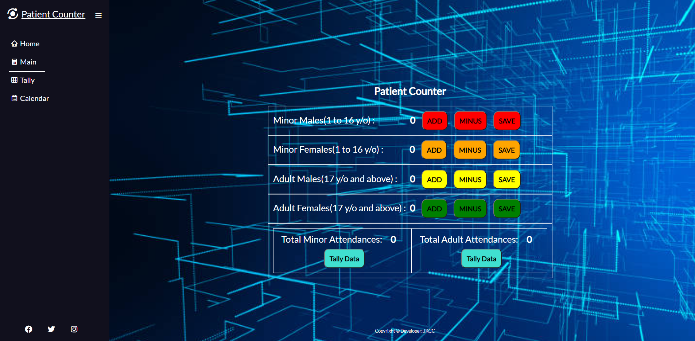

* Tally page where you can store in the future the data collected from the patient counter. For now, the Javascript functions are working only one time and resets itself when user leaves the page. Unfortunately, I dont have the time to properly fix it, I can not find a function or not yet learned how to store these data permanently and users will be able to save them. The site owners goal in the future is to improve this and properly make the page a worthwile app.
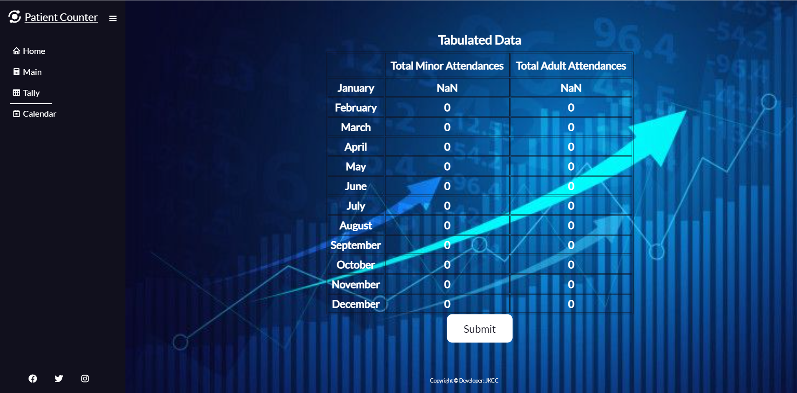

* Calendar page which at the moment is not finish, I am having problems with the functions I need to use and I ran out of time to finish this part of the project. In time, the site owner hopes to finish this page so users can choose the current date and previous dates and datas as well can be seen. Once I learn more how to code and how to do these things on my mind.
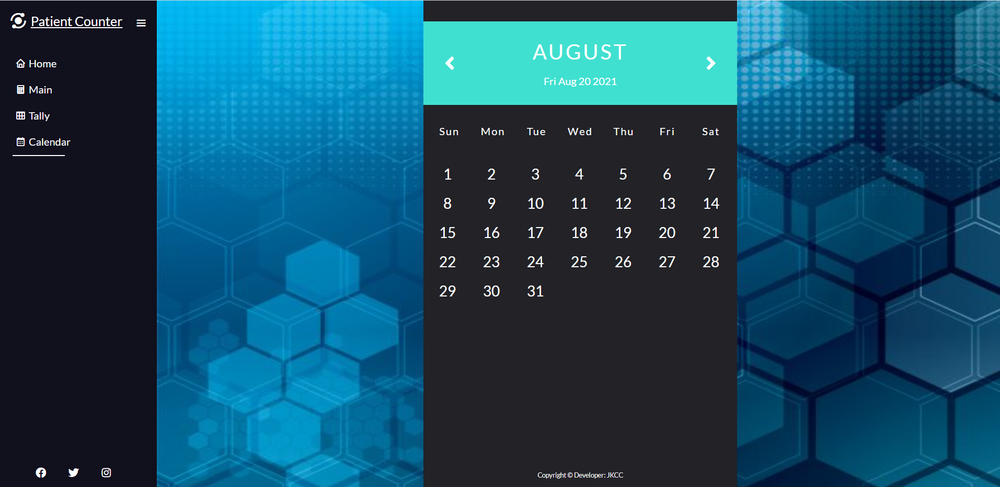

## Technologies Used

### Languages
1. HTML
2. CSS
3. Javascript

### Tools

1. Github
2. Gitpod
3. Font Awesome
4. Box Icons
5. Google Fonts
6. My laptop

---

## Features

The site contains a side nav bar, a patient counter desktop app and a tally table. All of these needs imprvement and polishing which I wasnt able to do due to lack of time and knowledge.
### Side and Nav Bars
* Featured on all pages
* The logos on top near the desktop app name, as well as the app name, when clicked will lead you to the home page.
* The side bar inlcudes all the pages of the website and when click will lead you to that page. In addition, social media network links are also seen at the bottom of the side bar, when clicked, or hovered to will response with some movement or changing of color to let the user know.
* User stories covered 1 and 2.
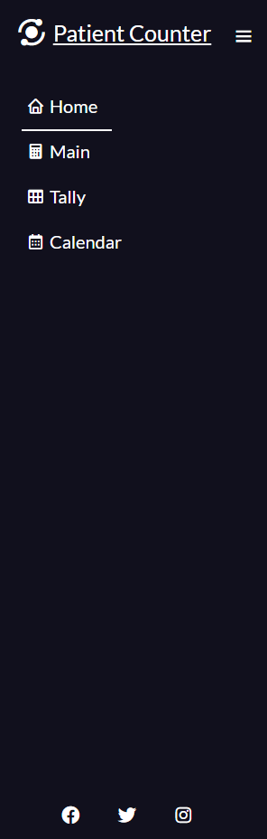
### Patient Counter
This can be seen on the main page, which was explained a while ago be operated usinga click of a mouse to count up or down and save buttons. In addition theres a tally button that you can click when you want to transfer the data collected for the day to a tally table on the tally page.
* User story covered 1.
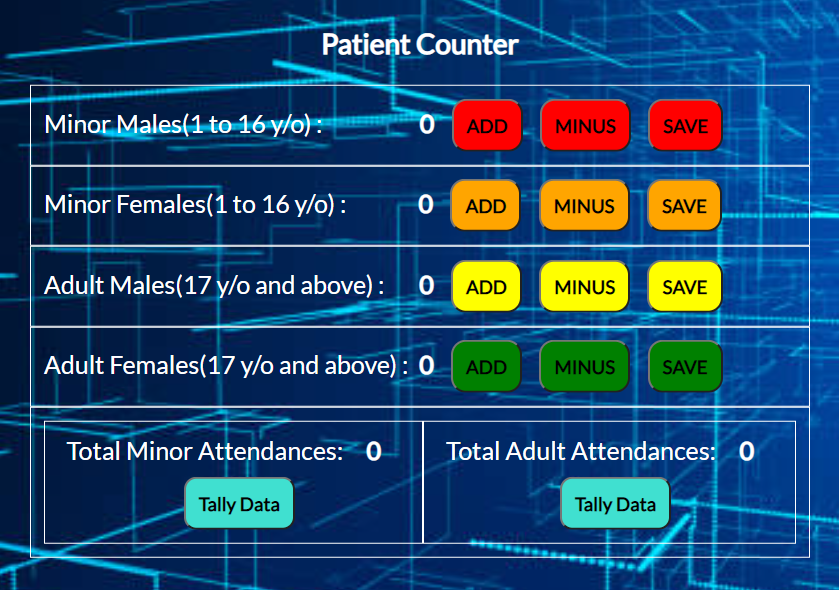

### Tally Table
This can be seen/found on the tally page portion of the site, when clicking the tally data button, this will automatically bring you to the tally page where you can see the total number for the day.
* User story covered 1.
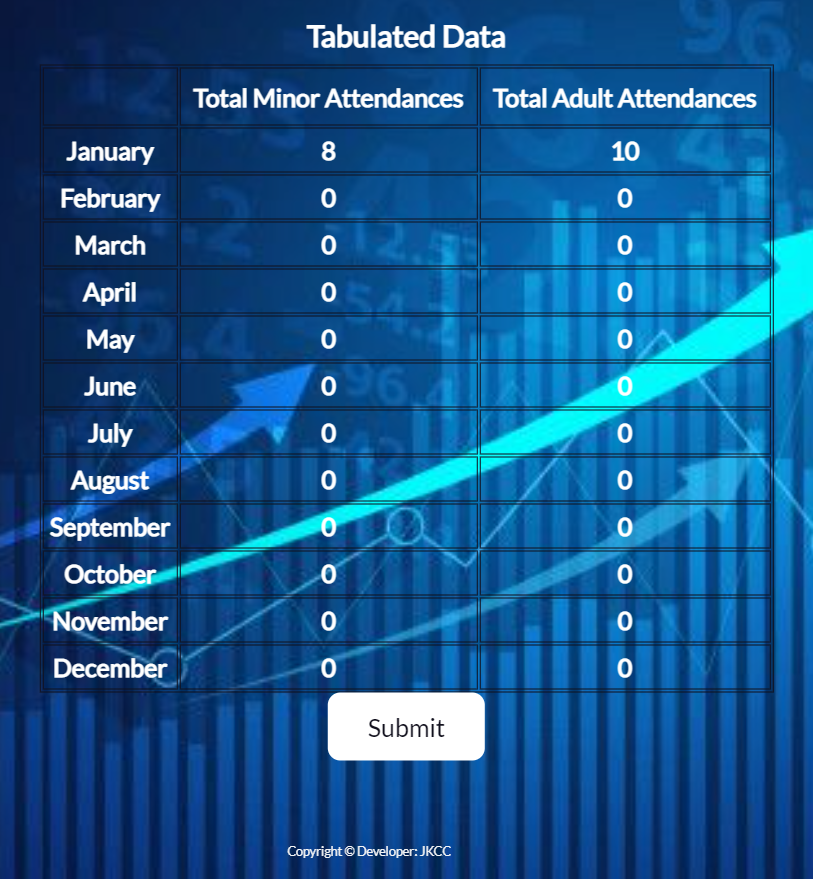
---
## Validation
### HTML validation
The html part of the site was validated using W3C Markup Validation service. All pages passed with no errors and 1 warning.
* Home Page
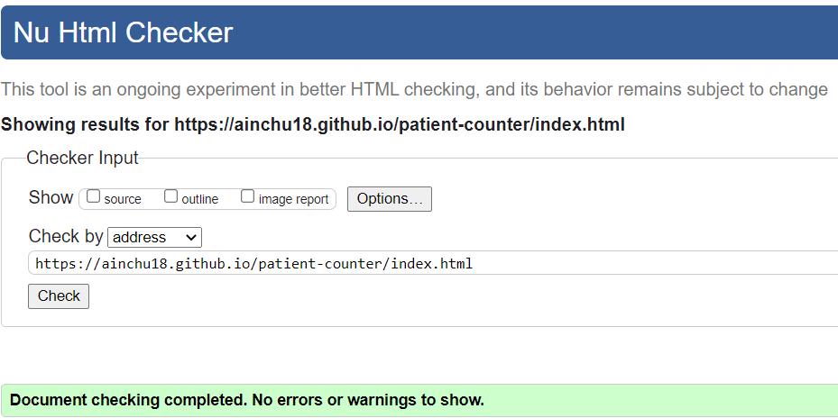

* Main Page
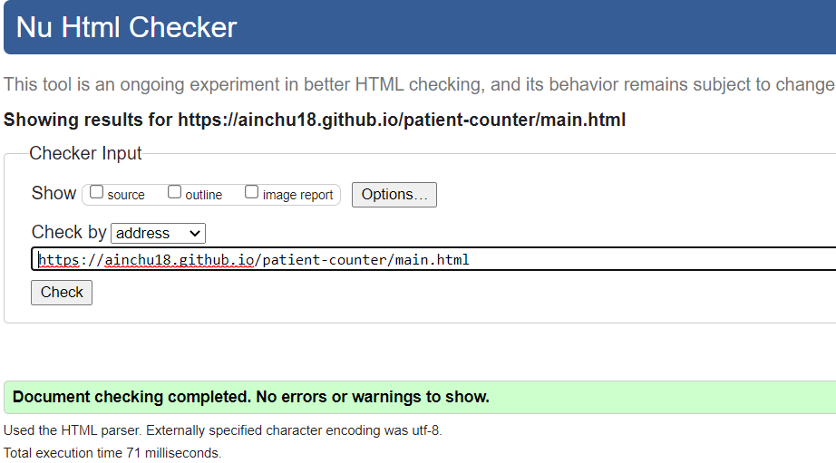

* Tally Page
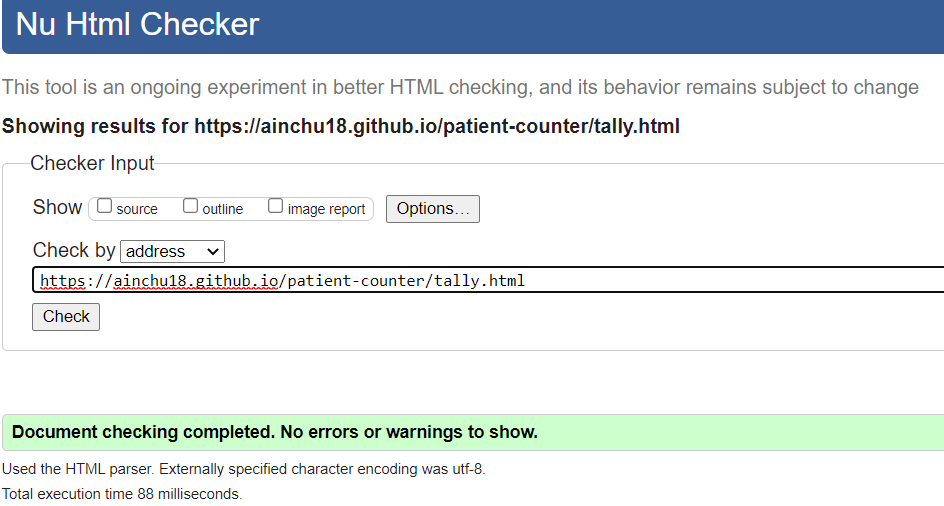

* Calendar Page
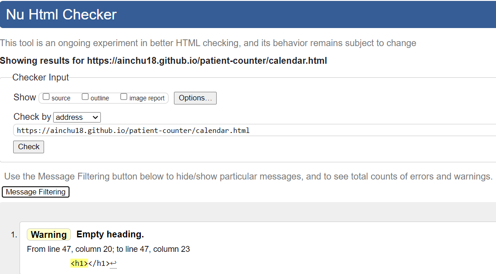

## CSS Validation

There seems to be a problem with the Jigsaw Validator so I just use the same validator for the HTML to check the CSS codes. There were no errors found.
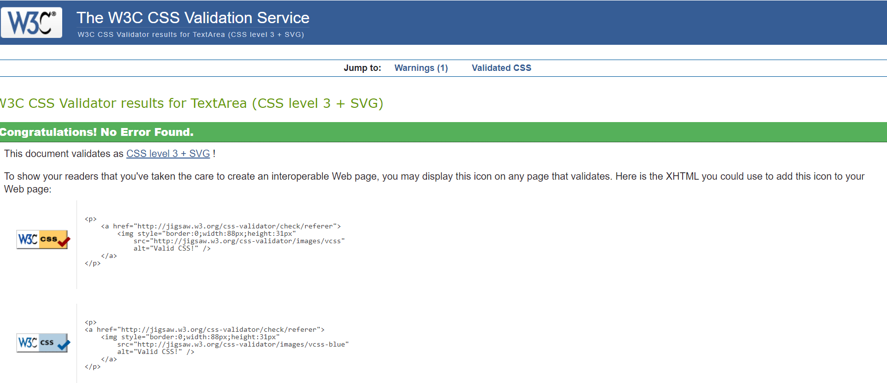

## Javascript Validation

JSHint was used to validate the javascript codes. There were no errors but loads of warnings. This in time will be fixed when I learn more about this and when I have time to do so.

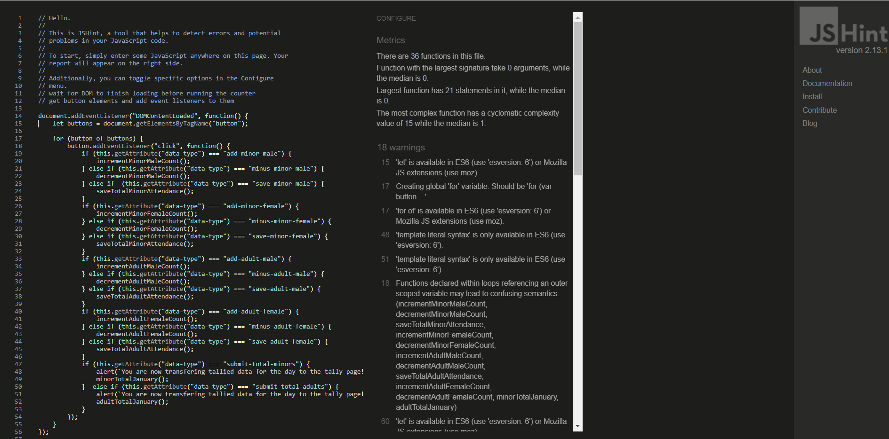
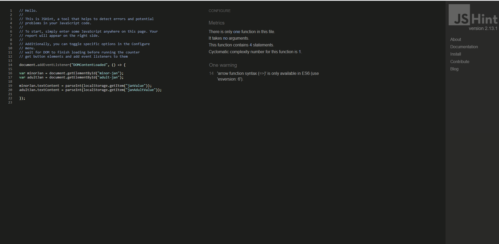
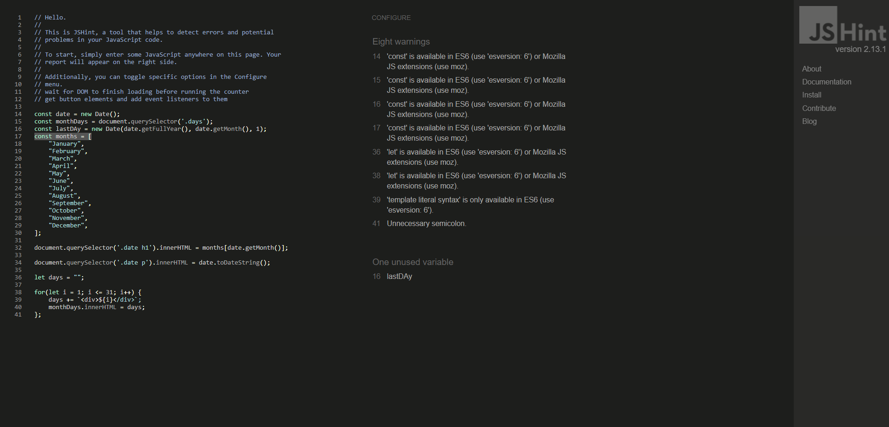