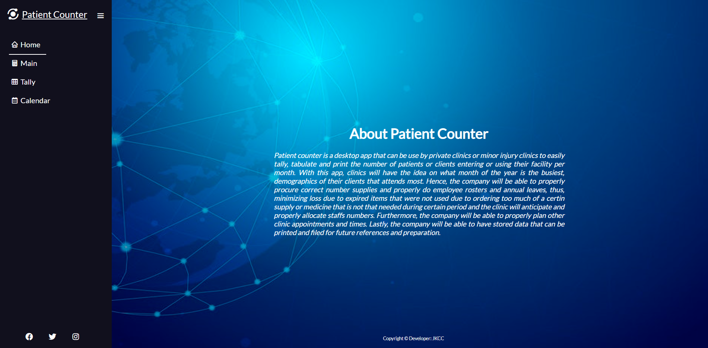

# Patient Counter
---
Developer : JKCC

[Go to the website](https://ainchu18.github.io/patient-counter/index.html)

---

## Goals
---
### User Goals
1. Find a desktop app that can help them count the number of people attedning their clinic.
2. Find information about the app.
3. Find an easy and simple way to track the clinics patients attendance.
4. Find a place where it can help them data about the demographics of people attending the clinic.

### Developer Goals
1. To develop a desktop app that can be use by private clinics or minor injury clinics to easily tally, tabulate and print the number of patients or clients entering or using their facility per month.
2. With this app, it is the aim of the developer for clinics to have the idea on what month of the year is the busiest, demographics of their clients that attends most.
3. Hence, to assist the company to properly procure correct number supplies and properly do employee rosters and annual leaves, thus, minimizing loss due to expired items that were not used due to ordering too much of a certin supply or medicine that is not that needed during certain period and the clinic will anticipate and properly allocate staffs numbers.
4. Furthermore, to help the company to be able to properly plan other clinic appointments and times. Lastly, to aide the company to be able to have stored data that can be printed and filed for future references and preparation.

## User Experience
---
### Target Crowd
1. Private clinics that caters minor injuries.
2. Small hospital that want to keep track of their patient attendance.

### User Expectation
1. An easy desktop counting app to use.
2. Simple website to navigate through.
---

## User Stories
---
* First time users
1. As a first time user, I want to know about the desktop app uses and how to operate it.
2. As a first time user, I want to easily navigate through pages.
* Returning Users
1. As a returning user, I will be able to easily get use on how to operate the patient counter.
* Site Owner
1. As a site owner, I want to improve more about the websites storing of data process and hopefully able to properly do a calendar page that automatically states the current date.
---

## Design

### 

